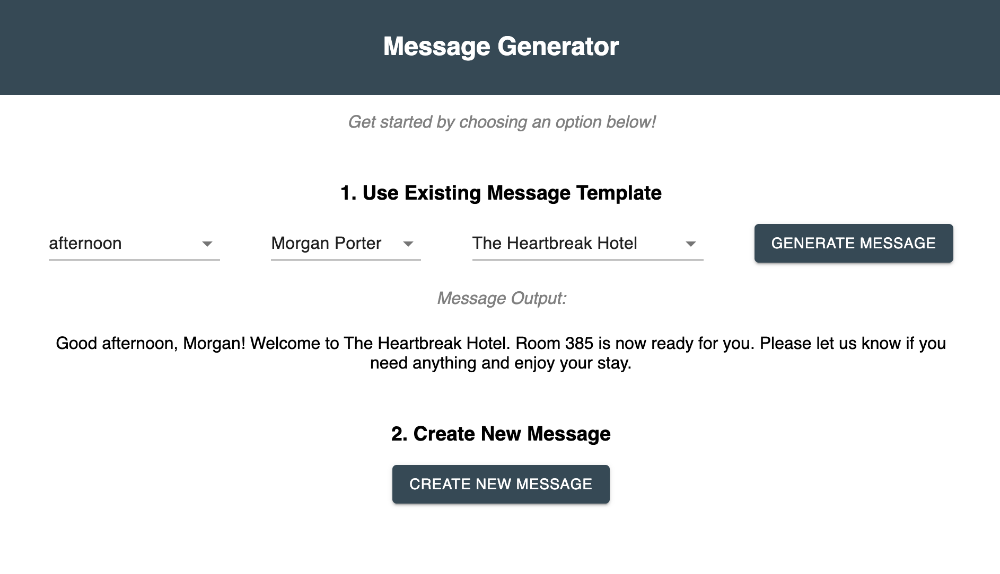

# Message Generator

## How to Run Program

### Prerequisites

- [Node.js](https://nodejs.org/en/)

### Installation
- Open your editor of choice and navigate to the project directory in your terminal.
- Run `npm install` in your terminal to install the project's node dependencies.
- Running the server code requires `nodemon`. If you don't already have `nodemon`, install it globally with `npm install nodemon --global`.
- Run `npm run server` in your terminal to start the server.
- Open a new terminal tab and run `npm run client` to start the react client app in a web browser.

### Usage
To generate a message for a guest using an existing template:
1. Select a time of day from the dropdown menu.
2. Select the guest name from the dropdown menu.
3. Select the company from the dropdown menu.
4. Click GENERATE MESSAGE and view the message displayed below with the selected information.

## Design Decisions

I provided dropdown menus for the user to select from pre-populated data in order to eliminate potential error in the user choosing or inputting a guest's name, a company name or a guest's room number. I displayed the message output below the dropdown menus so the user could see the message template for the information they are being prompted to select. When selecting the guest's name I included the first and last name in the dropdown menu even though just the first name is used for the message. I did this because it could occur that more than one guest could have the same first name and I wanted to ensure the correct room number is presented in the message.

In the App.jsx file, I stored the id of the object associated with the value selected in the dropdown menu. This way more than just the selected guest's name and company's name are stored in local state. Those pieces of state could then be accessed to get other information (including guest room number) and could be used for future message templates that could include additional information (such as company location). With how I setup the routes on the server side, it could make for a smoother transition to access information from a database if that were to be setup to store company and guest information in the future.

## Languages Used

I used a combination of HTML, CSS, MUI, React, Express and Node for this project. I used Express and Node to be able to access both company and guest data server side. I used MUI in combination with CSS to bring the project past the vanilla HTML layout and because I personally enjoy the style of MUI. I also used all of these languages, including React, because they are the ones I am the most familiar with at this time. Because of this, I determined I would be the most efficient with my time in using these languages for this project.

## Process for Verifying Correctness of Program

To verify the program was functioning how I intended, I tested my functions along the way by console logging variables and data. I did this to ensure I was getting the result I expected. I also used Postman in the beginning to test that my GET routes were working correctly to retrieve all the requested data. Lastly, I tested the program in the web browser, as a user, to make sure the data I selected was correctly populating in the message on the DOM and matching the data that was provided in the JSON files.

## What I Didn't Get to and Would Do With More Time

- I would move the message template information to a JSON file in the server like I did for the companies and guests data and access it there
- I would build out the functionality to allow a user to create and use their own message template
- I would create a way to autopopulate the morning, afternoon or evening times of day based on the actual time of day instead of having the user select it

